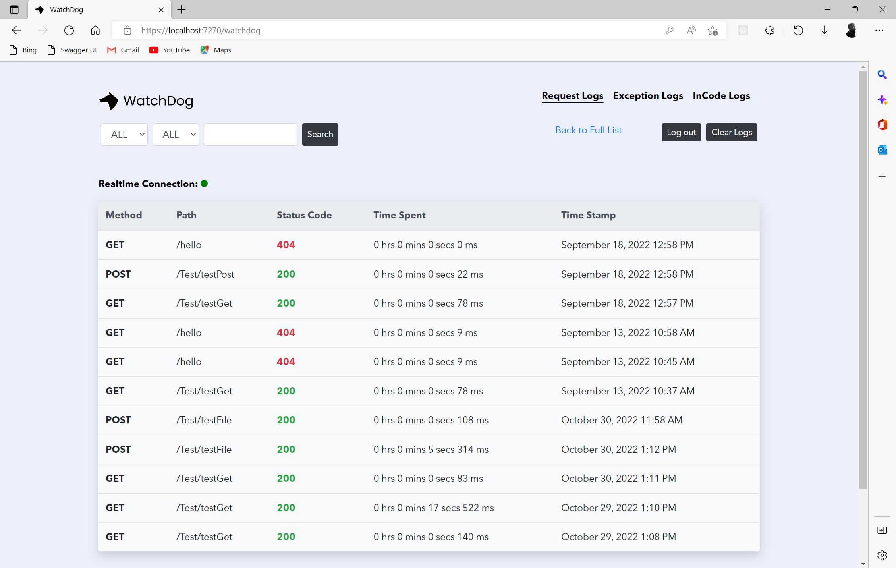
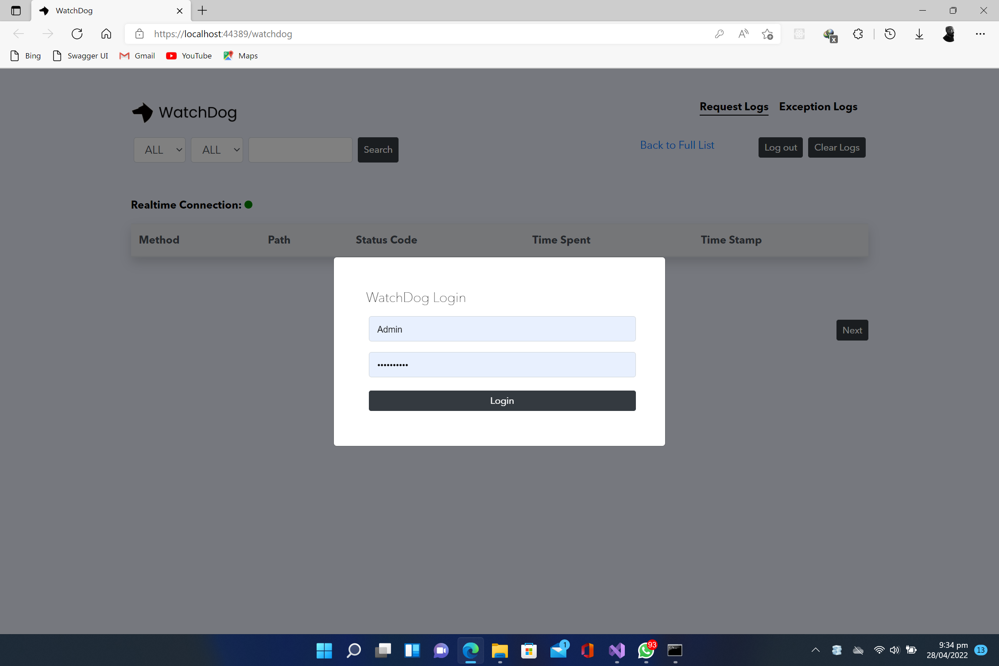
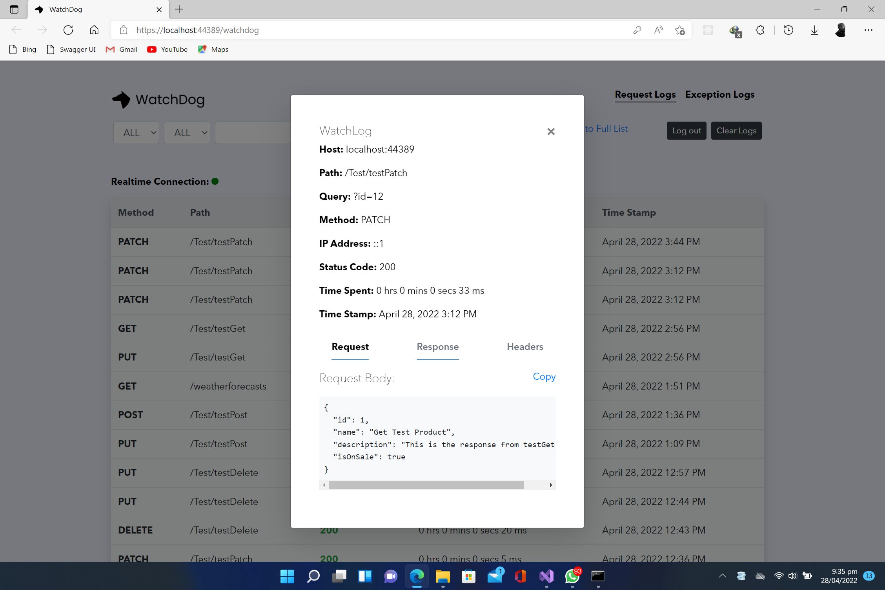
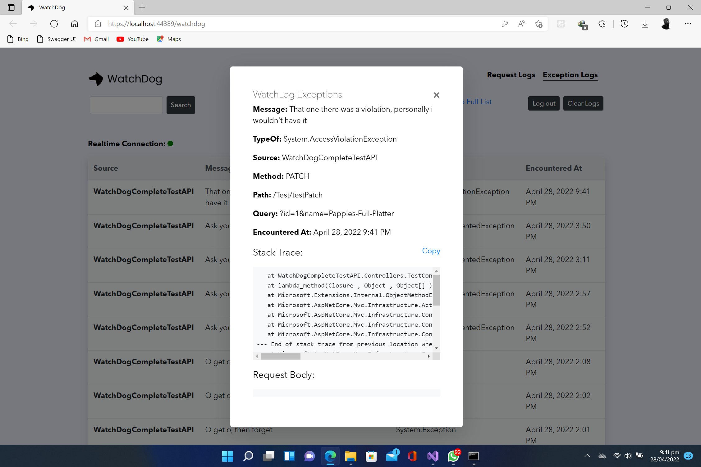

# 
# WatchDog


## Introduction

WatchDog is a Realtime HTTP (Request & Response) and Exception logger and viewer for ASP.Net Core Web Apps and APIs. It allows developers log and view http requests made to their web application and also exception caught during runtime in their web applications in Realtime.
It leverages on `LiteDb` a Serverless MongoDB-like database with no configuration and `SignalR` for real-time monitoring.

# 

## General Features

- RealTime HTTP Request and Response Logger
- RealTime Exception Logger
- User Friendly Logger Views
- Search Option for HTTP and Exception Logs
- Filtering Option for HTTP Logs using HTTP Methods and StatusCode
- Logger View Authentication
- Auto Clear Logs Option
 
## Installation

Install via .NET CLI

```bash
dotnet add package WatchDog.NET --version 1.0.1
```
Install via Package Manager

```bash
Install-Package WatchDog.NET --version 1.0.1
```


## Usage
To enable WatchDog to listen for requests, use the WatchDog middleware provided by WatchDog.

Add WatchDog Namespace in `Startup.cs`

```c#
using WatchDog;
```


### Register WatchDog service in `Startup.cs` under `ConfigureService()`

```c#
services.AddWatchDogServices();
```


### Setup AutoClear Logs `Optional`
This clears the logs after a specific duration.
```c#
services.AddWatchDogServices(opt => 
{ 
   opt.IsAutoClear = true; 
});
```


>**NOTE**
>When `IsAutoClear = true`
>Default Schedule Time is set to Weekly,  override the settings like below:


```c#
services.AddWatchDogServices(opt => 
{ 
   opt.IsAutoClear = true;
   opt.ClearTimeSchedule = WatchDogAutoClearScheduleEnum.Monthly;
});
```


### Add WatchDog middleware in the HTTP request pipeline in `Startup.cs` under `Configure()`
# 

>**NOTE**
>Add Authentication option like below: `Important`

This authentication information (Username and Password) will be used to access the log viewer.

```c#
app.UseWatchDog(opt => 
{ 
   opt.WatchPageUsername = "admin"; 
   opt.WatchPagePassword = "Qwerty@123"; 
 });
```

# 

#### Add list of routes you want to ignore by the logger: `Optional`
List of routes, paths or specific strings to be ignored should be a comma separated string like below.
```c#
app.UseWatchDog(opt => 
{ 
   opt.WatchPageUsername = "admin"; 
   opt.WatchPagePassword = "Qwerty@123"; 
   opt.Blacklist = "Test/testPost, weatherforecast";
 });
```

#### Add WatchDog Exception Logger `Optional`
This is used to log in-app exceptions that occur during a particular HTTP request.
# 

>**NOTE**
>Add Exception Logger before the main WatchDog Middleware


```c#
app.UseWatchDogExceptionLogger();

app.UseWatchDog(opt => 
{ 
   opt.WatchPageUsername = "admin"; 
   opt.WatchPagePassword = "Qwerty@123"; 
   opt.Blacklist = "Test/testPost, weatherforecast";
 });
```

### View Logs and Exception
Start your server and head to `/watchdog` to view the logs.
>Example: https://myserver.com/watchdog or https://localhost:[your port]/watchdog

Still confused? Check out the implementation in the [WatchDogCompleteTestAPI](https://github.com/IzyPro/WatchDog/tree/main/WatchDogCompleteTestAPI) folder

## Contribution
Feel like something is missing? Fork the repo and send a PR.

Encountered a bug? Fork the repo and send a PR.

Alternatively, open an issue and we'll get to it as soon as we can.

## Credit
Kelechi Onyekwere -  [Github](https://github.com/Khelechy) [Twitter](https://twitter.com/khelechy1337)

Israel Ulelu - [Github](https://github.com/IzyPro) [Twitter](https://twitter.com/IzyPro_)
